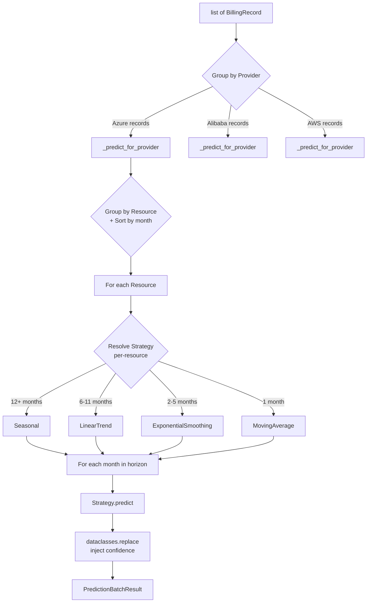
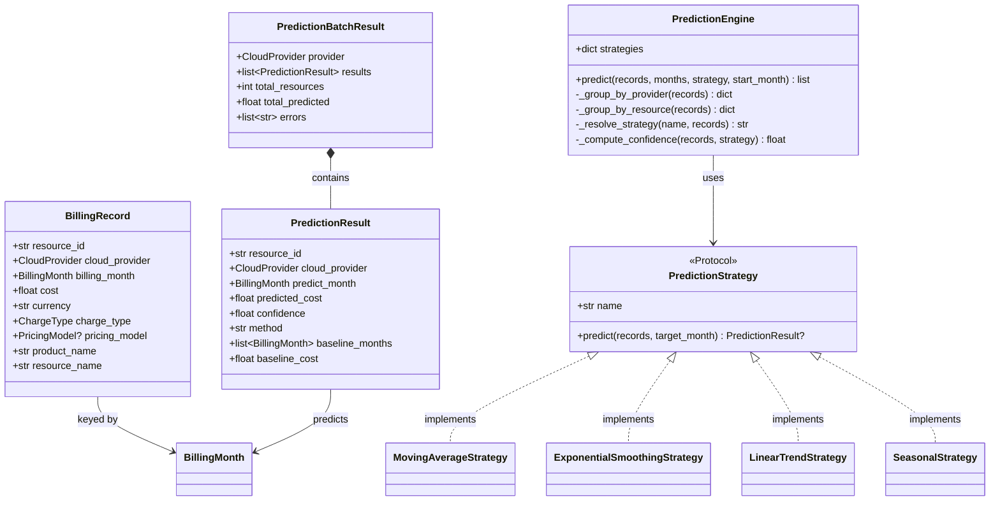

# Architecture

## Overview

cost-prediction is a framework-agnostic cloud cost prediction engine built on the Strategy pattern via Protocol. Zero external dependencies.

```
┌─────────────────────────────────────────────────────────┐
│                    PredictionEngine                      │
│  ┌─────────────┐  ┌──────────────┐  ┌───────────────┐  │
│  │ Group by    │  │ Resolve      │  │ Compute       │  │
│  │ Provider /  │  │ Strategy     │  │ Confidence    │  │
│  │ Resource    │  │ (per-res)    │  │ (back-test)   │  │
│  └─────────────┘  └──────────────┘  └───────────────┘  │
└────────────────────────┬────────────────────────────────┘
                         │
          ┌──────────────┼──────────────┐
          ▼              ▼              ▼
   ┌──────────┐  ┌──────────┐  ┌──────────┐  ┌──────────────┐
   │ Moving   │  │ Expo-    │  │ Linear   │  │ Seasonal     │
   │ Average  │  │ nential  │  │ Trend    │  │              │
   │          │  │ Smooth.  │  │          │  │              │
   └──────────┘  └──────────┘  └──────────┘  └──────────────┘
          ▲              ▲              ▲              ▲
          └──────────────┴──────────────┴──────────────┘
                   PredictionStrategy (Protocol)
```

## Data Flow



## Component Diagram



## Layer Architecture

```
┌─────────────────────────────────────────────┐
│                   Public API                 │
│  PredictionEngine, BillingRecord, types      │
├─────────────────────────────────────────────┤
│                Orchestration                  │
│  engine.py — grouping, routing, confidence   │
├─────────────────────────────────────────────┤
│                Strategy Layer                 │
│  moving_average, exponential_smoothing,      │
│  linear_trend, seasonal                      │
├─────────────────────────────────────────────┤
│                Domain Types                   │
│  BillingMonth, BillingRecord,                │
│  PredictionResult, enums                     │
└─────────────────────────────────────────────┘
```

## Key Design Decisions

### Protocol > ABC

Strategies use `typing.Protocol` instead of abstract base classes. Each strategy only needs `name` and `predict()` — no inheritance required. New strategies are discovered structurally, not by registration.

### Per-Resource Strategy Selection

Different resources in the same batch may have different history lengths (one has 24 months, another has 3). The engine resolves the best strategy for each resource individually — not one strategy for the whole batch.

### Sort Once

Records are sorted by `billing_month` once in `_group_by_resource`. Strategies assume sorted input and never re-sort, avoiding `O(resources × months × n log n)` redundant work.

### Immutable Data

All data types are `frozen=True` dataclasses. Predictions are constructed once and never mutated. `dataclasses.replace()` is used by the engine to inject confidence without modifying the original result.

### Back-Test Confidence

Confidence scores come from back-testing — the prediction function is tested against known historical months. No external labeled data required. The test window scales with data size: `max(3, min(12, n/4))`.

```

The Mermaid diagrams won't show the actual visual output in this text — see the rendered Markdown on GitHub.

