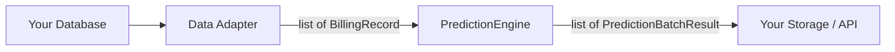

# Integration Guide

## Overview

cost-prediction is framework-agnostic. The engine expects `list[BillingRecord]` and returns `list[PredictionBatchResult]`. Your job: bridge your data source to `BillingRecord`, consume `PredictionResult`.



## Django Integration

### 1. Data Adapter

Create a bridge from your Django models to `BillingRecord`:

```python
# backend/prediction/data_adapter.py
from cost_prediction.types import BillingRecord, BillingMonth, CloudProvider

def db_to_billing_records(queryset) -> list[BillingRecord]:
    return [
        BillingRecord(
            resource_id=obj.resource_id,
            cloud_provider=CloudProvider(obj.cloud_provider),
            billing_month=BillingMonth.from_string(obj.billing_month.strftime("%Y-%m")),
            cost=float(obj.cost),
            currency=obj.currency or "CNY",
            product_name=obj.product_name or "",
            resource_name=obj.resource_name or "",
            resource_group=obj.resource_group or "",
            service_category=obj.service_category or "",
        )
        for obj in queryset
    ]
```

### 2. BillingRecord to PredictionResult

```python
# backend/prediction/data_adapter.py (continued)
def prediction_to_db(result, model_class):
    return model_class(
        resource_id=result.resource_id,
        cloud_provider=result.cloud_provider.value,
        predict_month=result.predict_month.to_string(),
        predicted_cost=result.predicted_cost,
        currency=result.currency,
        confidence=result.confidence,
        method=result.method,
        baseline_months=",".join(m.to_string() for m in result.baseline_months),
        baseline_cost=result.baseline_cost,
    )
```

### 3. Celery Task

```python
# backend/cloud_services/tasks/task_multi_cloud_bill_predict.py
from celery import shared_task
from cost_prediction import PredictionEngine

from .data_adapter import db_to_billing_records, prediction_to_db
from .models import BillingRecord as BillingRecordModel
from .models import PredictionResult as PredictionResultModel


@shared_task
def task__multi_cloud_bill_predict():
    engine = PredictionEngine()
    records = db_to_billing_records(BillingRecordModel.objects.all())
    batches = engine.predict(records, months=12)

    for batch in batches:
        for result in batch.results:
            prediction_to_db(result, PredictionResultModel).save()
```

### 4. Dependency

```toml
# pyproject.toml
[project]
dependencies = [
    "cost-prediction>=0.1.0",
]
```

## SQL Integration

```python
import json
from cost_prediction import PredictionEngine, BillingRecord, BillingMonth, CloudProvider

def load_records_from_db(cursor) -> list[BillingRecord]:
    cursor.execute("""
        SELECT resource_id, cloud_provider, billing_month, cost,
               currency, product_name
        FROM billing_records
        ORDER BY resource_id, billing_month
    """)
    return [
        BillingRecord(
            resource_id=row[0],
            cloud_provider=CloudProvider(row[1]),
            billing_month=BillingMonth.from_string(row[2]),
            cost=float(row[3]),
            currency=row[4] or "CNY",
            product_name=row[5] or "",
        )
        for row in cursor.fetchall()
    ]

def save_predictions(results, cursor):
    for batch in results:
        for r in batch.results:
            cursor.execute(
                "INSERT INTO predictions (resource_id, month, cost, method, confidence) "
                "VALUES (%s, %s, %s, %s, %s) "
                "ON CONFLICT (resource_id, month) DO UPDATE SET cost = EXCLUDED.cost",
                (r.resource_id, r.predict_month.to_string(),
                 r.predicted_cost, r.method, r.confidence),
            )
```

## CSV Integration

```python
import csv
from cost_prediction import PredictionEngine, BillingRecord, BillingMonth, CloudProvider

def load_from_csv(path: str) -> list[BillingRecord]:
    records = []
    with open(path) as f:
        for row in csv.DictReader(f):
            records.append(BillingRecord(
                resource_id=row["resource_id"],
                cloud_provider=CloudProvider(row["cloud_provider"]),
                billing_month=BillingMonth.from_string(row["billing_month"]),
                cost=float(row["cost"]),
                currency=row.get("currency", "CNY"),
                product_name=row.get("product_name", ""),
            ))
    return records
```

## Custom Strategy

```python
from cost_prediction.types import BillingMonth, BillingRecord, PredictionResult

class MyCustomStrategy:
    name = "my_custom"

    def predict(
        self,
        records: list[BillingRecord],
        target_month: BillingMonth,
    ) -> PredictionResult | None:
        if not records:
            return None
        first = records[0]
        return PredictionResult(
            resource_id=first.resource_id,
            cloud_provider=first.cloud_provider,
            predict_month=target_month,
            predicted_cost=42.0,
            currency=first.currency,
            method=self.name,
            baseline_months=[],
            baseline_cost=0.0,
        )

# Use it
from cost_prediction import PredictionEngine
from cost_prediction.strategies import PredictionStrategy

engine = PredictionEngine(strategies={
    "my_custom": MyCustomStrategy(),
    **PredictionEngine().strategies,
})
results = engine.predict(records, strategy="my_custom")
```

No registration required — any class with `name` and `predict()` works thanks to Protocol (structural subtyping).
