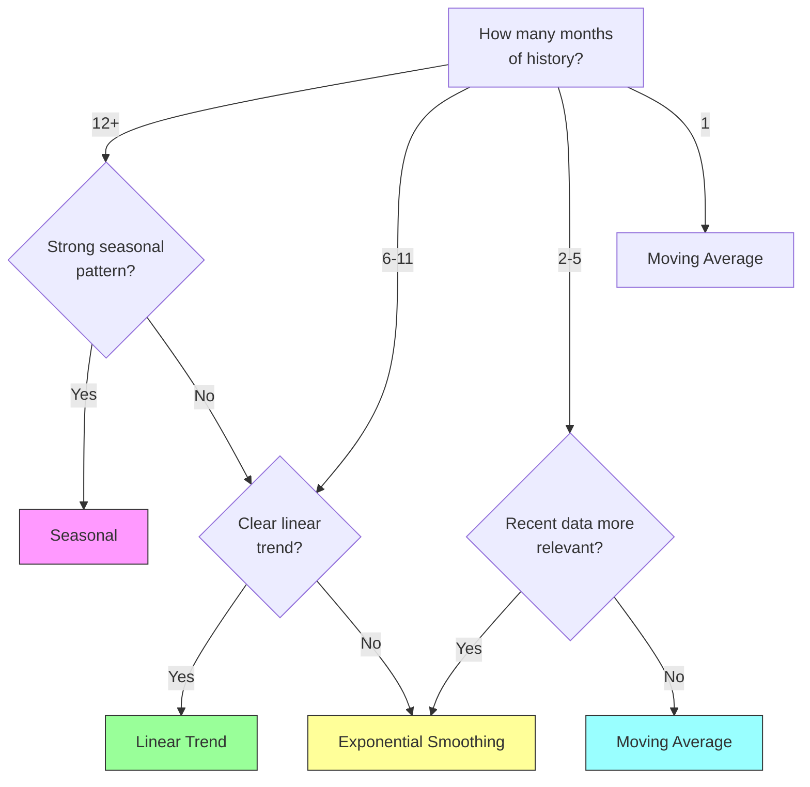

# Strategies

## Before You Predict: Normalization

For day-based billing (e.g. Alibaba prepaid ECS), normalize monthly costs to daily rates first. Otherwise, calendar variation (31-day vs 28-day months) looks like cost volatility and confuses the strategies.

```
records  →  to_daily_rates(records)  →  engine.predict()  →  to_monthly_rates(results)
```

See [Integration Guide](INTEGRATION.md#day-based-billing-alibaba-prepaid-ecs) for the full pipeline.

## Selection Flow



## Strategy Comparison

| Strategy | Min Data | Best For | How It Works | Alpha / Window |
|----------|----------|----------|-------------|----------------|
| `moving_average` | 1 month | Stable, flat workloads | Mean of last N months | `window_months=3` |
| `exponential_smoothing` | 2 months | Noisy data, gradual shifts | α × last + (1-α) × smoothed | `alpha=0.3` |
| `linear_trend` | 3 months | Consistent growth or decline | Linear regression + extrapolate | `window_months=6` |
| `seasonal` | 12 months | Annual patterns (retail, tax) | Seasonal factor × recent average | `window_months=12` |

## Strategy Details

Each strategy takes a list of `BillingRecord` (sorted by month, per-resource) and a target `BillingMonth`, and returns a `PredictionResult`.

---

### Moving Average

**Formula:**

$$P_{t+1} = \frac{1}{w} \sum_{i=0}^{w-1} Y_{t-i}$$

where `w` = `window_months`, `Y_t` = cost in month `t`.

**Interpretation:** Predict the mean of the last `w` months.

**Step-by-step (window=3, records=[100, 110, 120]):**

```
Window = last 3 records  →  [100, 110, 120]
P = (100 + 110 + 120) / 3  =  110.0
```

**Parameters:**

| Param | Default | Meaning |
|-------|---------|---------|
| `window_months` | 3 | Number of recent months to average. Larger = more stable, slower to adapt. |

**Edge cases:**

| Condition | Behavior |
|-----------|----------|
| 0 records | returns `None` |
| Fewer records than window | uses all available records |
| Minimum history | 1 month |

**Use when:** Stable, flat workloads. No trend, no seasonality.

---

### Exponential Smoothing

**Formula (Single Exponential Smoothing, SES):**

$$S_1 = Y_1$$
$$S_t = \alpha \cdot Y_t + (1 - \alpha) \cdot S_{t-1} \quad \text{for } t > 1$$
$$P_{t+1} = S_t$$

where `α` ∈ (0, 1), `S_t` = smoothed value at time `t`.

**Interpretation:** Each step blends the new observation (`Y_t`) with the previous smoothed value (`S_{t-1}`). Higher α → more weight on recent data. The weight of an observation at lag `k` decays as α(1-α)ᵏ.

**Step-by-step (α=0.3, records=[100, 110, 120]):**

```
S₁ = 100                          (initialize with first value)
S₂ = 0.3 × 110 + 0.7 × 100 = 103
S₃ = 0.3 × 120 + 0.7 × 103 = 108.1
P  = S₃ = 108.1                    (forecast = last smoothed value)
```

**Parameters:**

| Param | Default | Meaning |
|-------|---------|---------|
| `alpha` | 0.3 | Smoothing factor. Higher = more responsive to recent changes. |

**Alpha tuning:**

| α | Behavior | Suitable for |
|---|----------|-------------|
| 0.1 | Heavy smoothing, slow to react | Very stable series |
| 0.3 | Moderate (default) | Most workloads |
| 0.8 | Light smoothing, fast to react | Volatile, rapidly changing |

**Edge cases:**

| Condition | Behavior |
|-----------|----------|
| 0 records | returns `None` |
| α ≤ 0 or α ≥ 1 | raises `ValueError` |
| Minimum history | 1 month (returns first record's cost) |

**Use when:** Recent months are more indicative than older ones. Moderate noise.

---

### Linear Trend

**Formula (Ordinary Least Squares):**

Given window of `n` months with costs `Y = [y₀, y₁, ..., y_{n-1}]` at positions `x = [0, 1, ..., n-1]`:

$$\bar{x} = \frac{n-1}{2}, \quad \bar{y} = \frac{1}{n}\sum_{i=0}^{n-1} y_i$$

$$\beta = \frac{\sum_{i=0}^{n-1} (i - \bar{x})(y_i - \bar{y})}{\sum_{i=0}^{n-1} (i - \bar{x})^2}$$

$$\alpha = \bar{y} - \beta \cdot \bar{x}$$

$$P_{t+k} = \alpha + \beta \cdot (n + k - 1)$$

where `k` = months from last data point to target (e.g., predicting next month → k=1).

**Interpretation:** Fit a straight line through the window, then walk forward on that line.

**Step-by-step (window=3, records=[100, 110, 120], target=October, last record=March):**

```
Window = [100, 110, 120], n=3
x̄ = (3-1)/2 = 1.0
ȳ = (100+110+120)/3 = 110

β = ((0-1)(100-110) + (1-1)(110-110) + (2-1)(120-110)) / ((0-1)² + (1-1)² + (2-1)²)
  = (10 + 0 + 10) / (1 + 0 + 1)
  = 20/2 = 10

α = 110 - 10 × 1.0 = 100

k = months_between(March, October) = 7  (distance from last data point)
P = 100 + 10 × (3 + 7 - 1) = 100 + 10 × 9 = 190.0
```

**Parameters:**

| Param | Default | Meaning |
|-------|---------|---------|
| `window_months` | 6 | Number of recent months to fit trend. Must be ≥ 3. |

**Edge cases:**

| Condition | Behavior |
|-----------|----------|
| 0 records | returns `None` |
| < 3 records in window | returns `None` |
| Predicted cost < 0 | clamped to 0.0 |
| All costs identical (variance=0) | returns mean (β=0) |

**Use when:** Consistent month-over-month growth or decline.

---

### Seasonal

**Formula (Seasonal Decomposition):**

Given a window of 12+ months:

$$S_m = \frac{1}{c_m} \sum_{i \in \text{month } m} Y_i \quad \text{(average cost for calendar month } m \text{)}$$

$$\bar{Y} = \frac{1}{n} \sum Y_i \quad \text{(overall average)}$$

$$F_m = \frac{S_m}{\bar{Y}} \quad \text{(seasonal factor for month } m \text{)}$$

$$R = \frac{1}{3} \sum_{i=1}^{3} Y_{t - i + 1} \quad \text{(recent 3-month average)}$$

$$P = R \times F_m$$

**Interpretation:** "How much higher/lower is month `m` than average?" Apply that factor to the recent trend.

**Step-by-step (window=12, records Jan-Dec 2025, target=January 2026):**

```
Monthly averages:
  Jan: ¥600, Feb: ¥620, Mar: ¥610, ..., Dec: ¥710
  Overall avg Ȳ = (600+620+...+710) / 12 = 655

Seasonal factor for January:
  F_jan = 600 / 655 = 0.916  (January is ~8% below average)

Recent trend:
  R = (690 + 700 + 710) / 3 = 700  (last 3 months: Oct-Dec)

Prediction:
  P = 700 × 0.916 = 641.2
```

**Parameters:**

| Param | Default | Meaning |
|-------|---------|---------|
| `window_months` | 12 | History window. Must be ≥ 12 for seasonal detection. |

**Edge cases:**

| Condition | Behavior |
|-----------|----------|
| 0 records | returns `None` |
| < 12 records in window | returns `None` |
| No records for target month in window | returns `None` |
| Overall average ≤ 0 | seasonal factor = 1.0 (no adjustment) |

**Use when:** Annual recurring patterns (e.g., retail peaks in Q4, tax season).

## Auto Strategy Selection

When `strategy="auto"` (default), the engine picks based on data volume:

```
n >= 12  → seasonal
n >= 6   → linear_trend
n >= 2   → exponential_smoothing
n >= 1   → moving_average
```

Selection is per-resource, so a batch with mixed history lengths gets per-resource strategy assignment.

## Custom Strategy Parameters

```python
from cost_prediction import PredictionEngine
from cost_prediction.strategies import ExponentialSmoothingStrategy, LinearTrendStrategy

engine = PredictionEngine(strategies={
    "exponential_smoothing": ExponentialSmoothingStrategy(alpha=0.5),
    "moving_average": MovingAverageStrategy(window_months=6),
    "linear_trend": LinearTrendStrategy(window_months=12),
    "seasonal": SeasonalStrategy(window_months=24),
})
```
