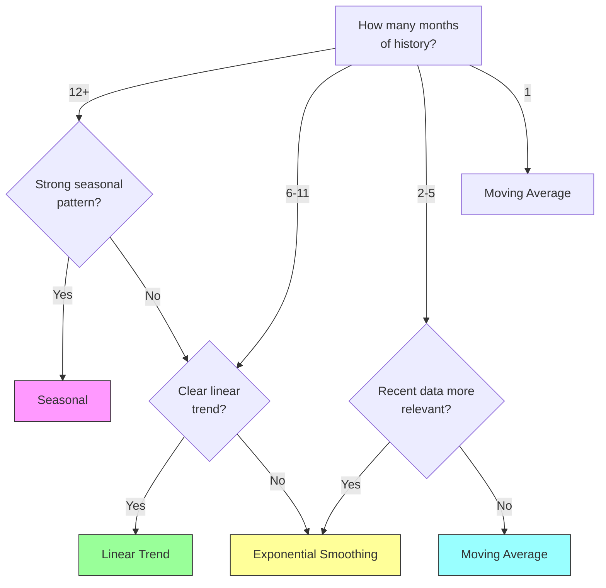
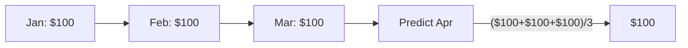
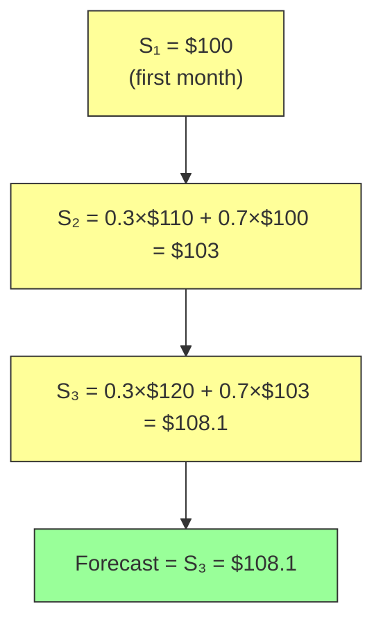
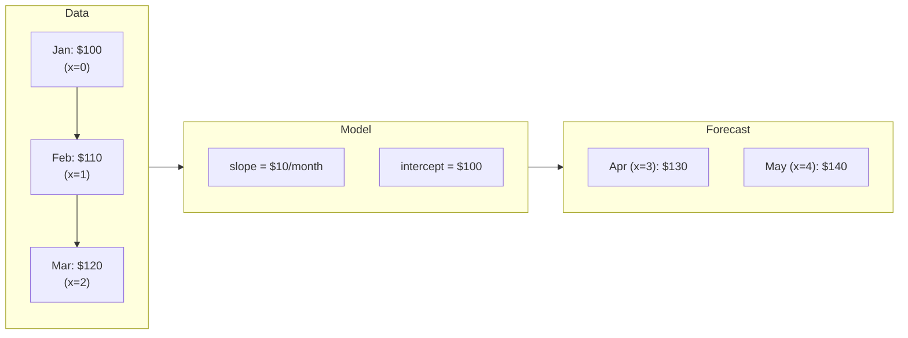
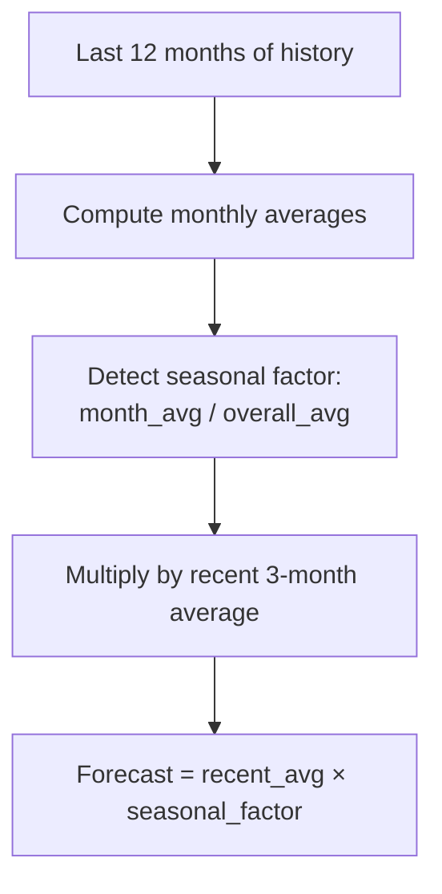

# Strategies

## Before You Predict: Normalization

For day-based billing (e.g. Alibaba prepaid ECS), normalize monthly costs to daily rates first. Otherwise, calendar variation (31-day vs 28-day months) looks like cost volatility and confuses the strategies.

```
records  →  to_daily_rates(records)  →  engine.predict()  →  to_monthly_rates(results)
```

See [Integration Guide](INTEGRATION.md#day-based-billing-alibaba-prepaid-ecs) for the full pipeline.

## Selection Flow



## Strategy Comparison

| Strategy | Min Data | Best For | How It Works | Alpha / Window |
|----------|----------|----------|-------------|----------------|
| `moving_average` | 1 month | Stable, flat workloads | Mean of last N months | `window_months=3` |
| `exponential_smoothing` | 2 months | Noisy data, gradual shifts | α × last + (1-α) × smoothed | `alpha=0.3` |
| `linear_trend` | 3 months | Consistent growth or decline | Linear regression + extrapolate | `window_months=6` |
| `seasonal` | 12 months | Annual patterns (retail, tax) | Seasonal factor × recent average | `window_months=12` |

## Strategy Details

### Moving Average



Simplest strategy. Takes the arithmetic mean of the last `window_months`. Zero parameters to tune. The fallback when nothing else fits.

**Use when**: Costs are stable. No growth, no seasonality, no noise.

### Exponential Smoothing



Weights recent observations more heavily. Older data decays exponentially: weight at lag k = α(1-α)^k.

**Alpha tuning**:
- `α = 0.1` — heavy smoothing, slow to respond (stable series)
- `α = 0.3` — moderate smoothing (default)
- `α = 0.8` — light smoothing, fast to respond (volatile series)

**Use when**: Recent months are more indicative than older ones. Moderate noise.

### Linear Trend



Fits `y = ax + b` via least squares, then extrapolates. Predictions clamp to 0 for negative trends.

**Use when**: Consistent month-over-month growth or decline. 3 months minimum.

### Seasonal



Detects year-over-year patterns. If January is typically 150% of the annual average, upcoming January predictions get a 1.5× multiplier.

**Use when**: Annual recurring patterns. 12 months minimum.

## Auto Strategy Selection

When `strategy="auto"` (default), the engine picks based on data volume:

```
n >= 12  → seasonal
n >= 6   → linear_trend
n >= 2   → exponential_smoothing
n >= 1   → moving_average
```

Selection is per-resource, so a batch with mixed history lengths gets per-resource strategy assignment.

## Custom Strategy Parameters

```python
from cost_prediction import PredictionEngine
from cost_prediction.strategies import ExponentialSmoothingStrategy, LinearTrendStrategy

engine = PredictionEngine(strategies={
    "exponential_smoothing": ExponentialSmoothingStrategy(alpha=0.5),
    "moving_average": MovingAverageStrategy(window_months=6),
    "linear_trend": LinearTrendStrategy(window_months=12),
    "seasonal": SeasonalStrategy(window_months=24),
})
```
